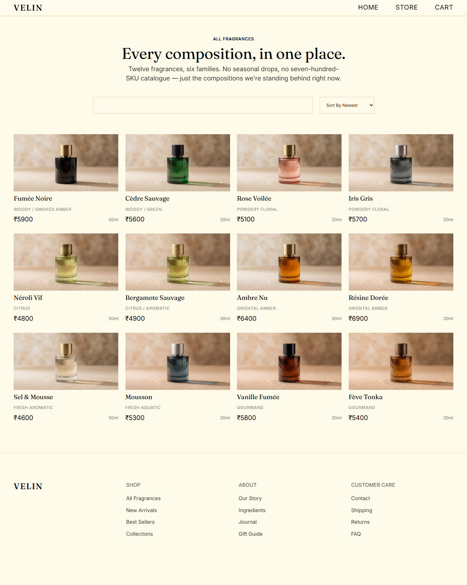
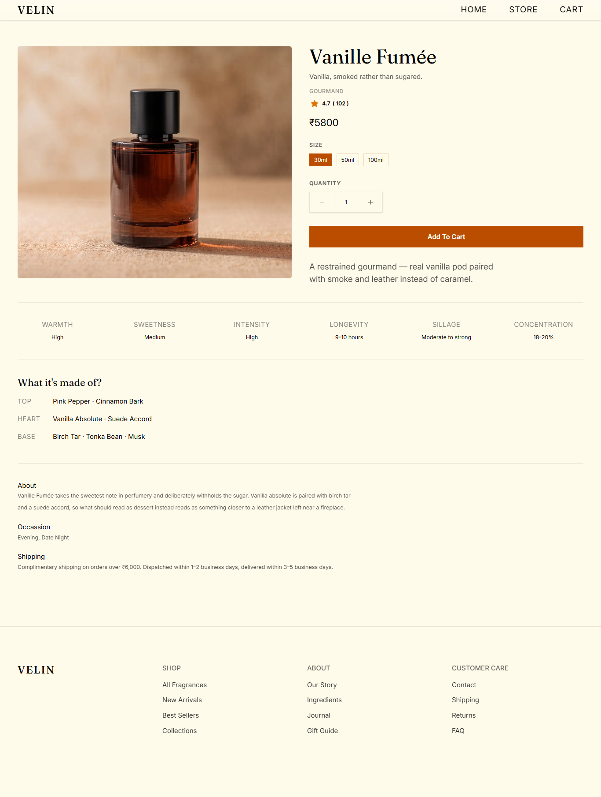
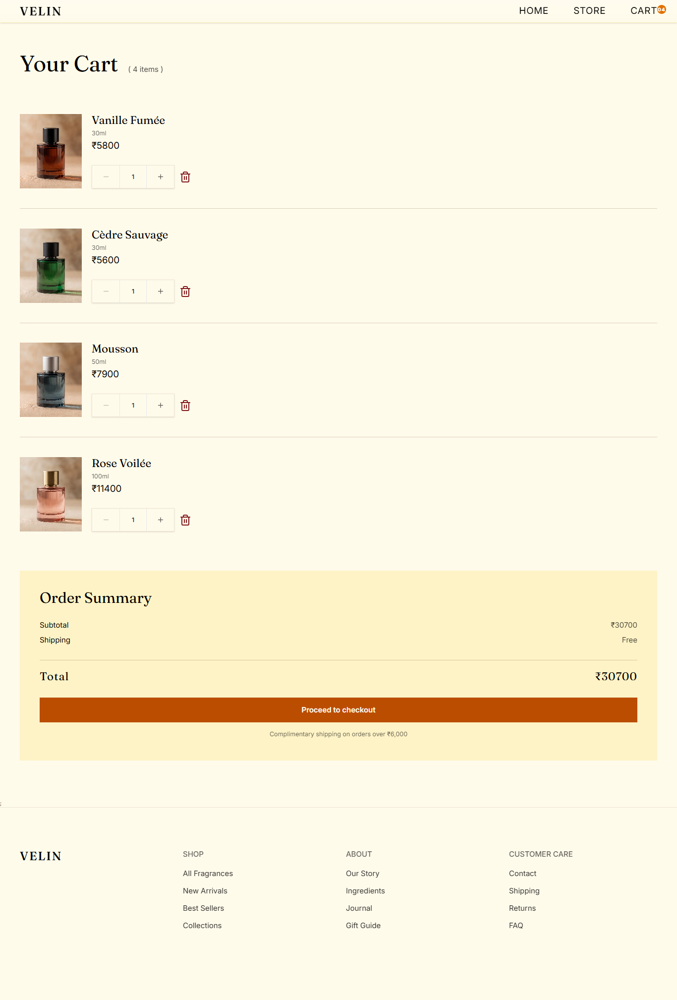
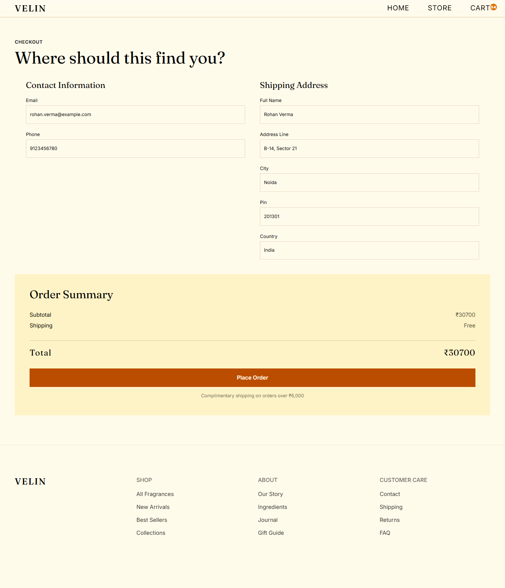
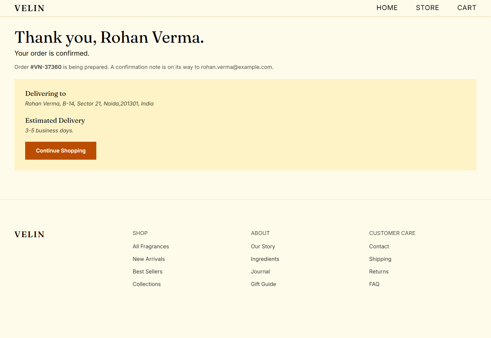

# Velin — Fragrance E-Commerce Website

Velin is a modern fragrance e-commerce website built with React and Vite.

The project was created as a frontend development project to practice React fundamentals, state management, routing, forms, browser storage, responsive UI, and reusable components while building a realistic shopping experience.

## ✨ Features

- Browse fragrance products
- Search products by name
- Sort products by:
  - Newest
  - Low price
  - High price

- View detailed product information
- Select fragrance size
- Select product quantity
- Add products to cart
- Add the same fragrance in different sizes as separate cart items
- Increase and decrease cart quantities
- Remove products from cart
- Persistent cart using `localStorage`
- Checkout form
- Form validation
- Order confirmation page
- Generated order number
- Responsive design for different screen sizes
- Accessible interactive elements
- Reusable React components

## 🛠️ Tech Stack

- **React**
- **Vite**
- **JavaScript (ES6+)**
- **React Router**
- **Tailwind CSS**
- **Lucide React**
- **Browser localStorage**

## 🧠 React Concepts Practiced

This project was also built as a learning project to strengthen practical React knowledge.

Some of the concepts used include:

- Functional components
- Props
- `useState`
- `useEffect`
- `useReducer`
- Context API
- Derived state
- Event handling
- Controlled form inputs
- Conditional rendering
- Array methods such as `map`, `filter`, `find`, `some`, and `sort`
- React Router
- State persistence with `localStorage`
- Component composition
- Reusable UI components

## 🛒 Cart Architecture

The shopping cart is managed using **React Context + \*\***`useReducer`\*\*.

The cart reducer handles actions such as:

- Adding an item
- Increasing quantity
- Decreasing quantity
- Removing an item

A product's **ID + selected size** is treated as _the identity of a cart line._

This allows the same fragrance to be added in different sizes without combining them incorrectly.

For example:

```text
Velin Noir — 30ml  × 2
Velin Noir — 100ml × 1
```

These remain separate cart items.

The cart is also persisted to `localStorage`, allowing the cart to survive a page refresh.

The project is organized around reusable components and separates UI, pages, state management, hooks, constants, and utility functions.

## 🚀 Getting Started

### Prerequisites

Make sure you have Node.js installed.

### Installation

Clone the repository:

```bash
git clone https://github.com/mohit-vb/velin.git
```

Navigate to the project:

```bash
cd velin
```

Install dependencies:

```bash
npm install
```

Start the development server:

```bash
npm run dev
```

The application will then be available at the local development URL shown by Vite.

## 🎯 Project Goals

The main goal of Velin was not simply to create a visually appealing store, but to build a realistic React application and practice the concepts used in frontend development.

Particular focus was placed on:

- Managing application state
- Designing reusable components
- Building a functional shopping cart
- Handling product variants
- Working with forms
- Persisting data in the browser
- Creating responsive interfaces
- Writing clean and maintainable React code

## 📌 Disclaimer

Velin is a frontend portfolio/learning project. Products, pricing, orders, and checkout functionality are for demonstration purposes and do not represent a real e-commerce service.

## 👨‍💻 Author

**Mohit Jadhav**

Frontend Developer

[GitHub](https://github.com/mohit-vb)

## 📸 Preview







